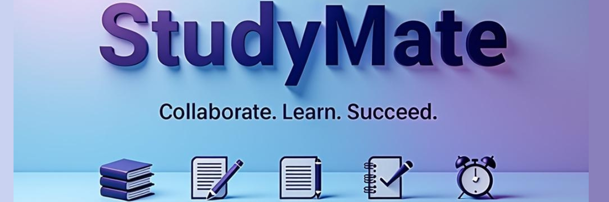

  

## 🚀 What's This?

**StudyMate** transforms how students learn together! Say goodbye to chaotic study sessions and scattered resources. Our platform creates a seamless collaborative experience where materials, goals, notes, and progress tracking live in perfect harmony.

> _"StudyMate has completely transformed how our study group works together! No more 'Where's that PDF again?' or 'How long did we study yesterday?'"_ — Totally real student testimonial 😉

## 🌟 Features That Make Studying Awesome

| Feature | What It Does | Why You'll Love It |
|---------|-------------|-------------------|
| 📚 **Resource Hub** | Share and categorize study materials | Find what you need in seconds with smart search |
| 🎯 **Goal Tracker** | Set and monitor study objectives | Stay motivated with visual progress indicators |
| 📝 **Collaborative Notes** | Create and edit notes together | Real-time editing with your study buddies |
| ⏱️ **Study Sessions** | Track your studying time | See your productivity patterns with beautiful stats |

## 🛠️ Get Up & Running in 2 Seconds

Open **[StudyMate](http://localhost:3000](https://study-mate-rho.vercel.app/))** and begin your journey to study enlightenment!

## 💡 How StudyMate Changes The Game

Simply navigate our intuitive tabbed interface:

- **Resources:** Drag-and-drop file sharing that even your grandma could use
- **Goals:** Set deadlines and crush them one by one
- **Notes:** Collaborative note-taking that actually makes sense
- **Sessions:** Track every minute of your productive genius

## 🔮 The Future Is Bright

We're not stopping here! Coming soon:
- 👤 User profiles
- ☁️ Cloud storage integration
- 📱 Mobile app
- 📊 Mind-blowing analytics dashboard

## 👋 Let's Connect!

Made with ❤️ by [Amen Divine](https://github.com/amen-ikamba)

[✉️ Email](mailto:iamendivine@gmail.com) | [🐦 Twitter](https://twitter.com/AmenIkamba) | [💼 LinkedIn](https://linkedin.com/in/amen123)

---

Remember: Study smarter, not harder! 🧠✨

